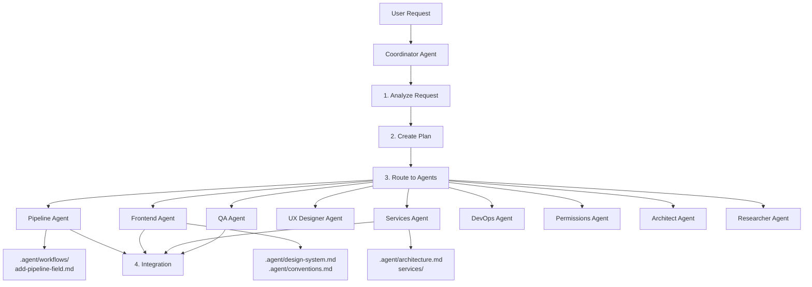

# AI Agent Orchestration System

## Overview

The Aether Foundation project uses a **multi-agent orchestration system** where a **Coordinator Agent** analyzes requests and routes tasks to specialized agents with the correct context.

---

## Architecture



---

## How It Works

### 1. **User Makes Request**
```
User: "Add a priority field to students"
```

### 2. **Coordinator Analyzes**
```yaml
Type: Pipeline modification
Complexity: Moderate
Required Agents:
  - Pipeline (primary)
  - Frontend (verification)
  - Services (validation)
  - QA (testing)
```

### 3. **Coordinator Routes with Context**

**To Pipeline Agent:**
```
@Pipeline Agent
Context: @.agent/workflows/add-pipeline-field.md
         @types/pipeline.ts
         @services/platformDatabase.ts

Task: Add priority field (select: High/Medium/Low) to student pipeline
```

**To Services Agent:**
```
@Services Agent
Context: @services/validation.ts
         @types/pipeline.ts

Task: Add validation for priority field
```

**To QA Agent:**
```
@QA Agent
Context: @.agent/workflows/test-locally.md

Task: Test priority field creation and validation
```

### 4. **Coordinator Verifies Integration**
```
✓ Pipeline config updated
✓ Validation added
✓ UI rendering correctly
✓ Tests passing
✓ Build successful
```

---

## Agent Capabilities Matrix

| Agent | Domain | Primary Context Files | When to Use |
|-------|--------|----------------------|-------------|
| **Coordinator** | Orchestration | All `.agent/` docs | Complex multi-step tasks |
| **Pipeline** | Pipeline config | `workflows/add-pipeline-field.md` | Add/modify stages/fields |
| **Frontend** | UI components | `design-system.md`, `conventions.md` | Create/modify components |
| **Services** | Business logic | `architecture.md`, `services/` | Database, validation, APIs |
| **Permissions** | RBAC | `workflows/modify-permissions.md` | Role/permission changes |
| **Architect** | System design | `architecture.md`, `decisions.md` | Refactoring, types, design |
| **UX Designer** | Design | `design-system.md` | UI/UX design decisions |
| **QA** | Testing | `workflows/test-locally.md` | Testing, debugging |
| **DevOps** | Infrastructure | `infrastructure.md` | Deployment, CI/CD |
| **Researcher** | Research | External sources | Market research, discovery |

---

## Context Passing Rules

The Coordinator **always** includes:
- `.agent/context.md` (project overview)
- `.agent/conventions.md` (code standards)

**Domain-specific context:**

### Pipeline Tasks
```
- .agent/workflows/add-pipeline-field.md
- types/pipeline.ts
- services/platformDatabase.ts
```

### UI Tasks
```
- .agent/design-system.md
- .agent/conventions.md
- components/ (relevant files)
```

### Permission Tasks
```
- .agent/workflows/modify-permissions.md
- services/permissions/
- types/permissions.ts
```

### Database Tasks
```
- .agent/architecture.md
- .agent/data-sync-strategy.md
- services/database/
```

### Integration Tasks (Foundation ↔ Support)
```
- .agent/cross-app-integration.md
- .agent/ecosystem.md (from Support)
- Both project contexts
```

---

## Request Routing Decision Tree

```
Request received
    ↓
Is it a question? → Answer directly
    ↓
Is it simple (single file/single agent)? → Route to specialist
    ↓
Is it complex (multi-step/multi-agent)? → Coordinator creates plan
    ↓
    Break down into subtasks
    ↓
    For each subtask:
        1. Identify required agent
        2. Assemble context
        3. Execute
        4. Verify
    ↓
    Integrate all results
    ↓
    Run tests
    ↓
    Report to user
```

---

## Usage Examples

### Example 1: Simple Request → Direct Routing
```
User: "Where is the login component?"
→ Direct answer (no agent needed)

User: "Add a button to the navbar"
→ Frontend Agent (single agent, simple task)
```

### Example 2: Moderate Request → Coordinator Plans
```
User: "Add customer satisfaction rating to students"

Coordinator Plan:
├─ Pipeline Agent → Add rating field
├─ Frontend Agent → Verify UI renders correctly
├─ Services Agent → Add validation
└─ QA Agent → Test feature
```

### Example 3: Complex Request → Full Orchestration
```
User: "Integrate chat from Support into Foundation's CRM"

Coordinator Plan:
├─ Researcher → Study integration patterns
├─ Architect → Design integration architecture
├─ Services Agent (Foundation) → Add API endpoints
├─ Services Agent (Support) → Expose chat widget
├─ Frontend Agent → Integrate chat UI
├─ DevOps → Deploy both apps
└─ QA → End-to-end testing
```

---

## Automation with Cursor

### Manual Invocation
```
@coordinator Add a priority field to students
```

### Automatic Context Loading
Configure Cursor to always load:
```json
{
  "cursor.ai.alwaysIncludeContext": [
    ".agent/**/*.md",
    ".cursor/agents/**/*.md",
    ".cursorrules"
  ]
}
```

---

## Coordinator vs Specialized Agents

| Use Coordinator | Use Specialized Agent |
|-----------------|----------------------|
| ✅ Complex multi-step tasks | ✅ Single-domain simple tasks |
| ✅ Cross-cutting concerns | ✅ Clear, focused scope |
| ✅ Uncertain requirements | ✅ Well-defined requirements |
| ✅ Multiple agents needed | ✅ One agent sufficient |

---

## Context Auto-Loading

For Cursor to automatically use agent docs, create:

### `.vscode/settings.json`
```json
{
  "cursor.ai.alwaysIncludeContext": [
    ".agent/**/*.md",
    ".cursor/agents/**/*.md",
    ".cursorrules",
    "README.md"
  ],
  "cursor.ai.includeContextFromOpenFiles": true,
  "cursor.ai.model": "claude-4.5-sonnet"
}
```

### `aether-systems.code-workspace`
```json
{
  "folders": [
    {
      "name": "Aether Foundation (CRM)",
      "path": "."
    },
    {
      "name": "Aether Support",
      "path": "./aether-support"
    }
  ],
  "settings": {
    "cursor.ai.alwaysIncludeContext": [
      ".agent/**/*",
      ".cursor/agents/**/*",
      ".cursorrules"
    ]
  }
}
```

---

## Integration with Dev MCP Server

The Coordinator can leverage your Dev MCP server for:
- **Perplexity**: Research questions
- **Gemini**: Code generation
- **GitHub**: Issue tracking
- **Netlify**: Deployments
- **Supabase**: Database queries

See `.agent/mcp-server-config.md` for setup.

---

## Best Practices

### For Users
1. **Start with Coordinator** for complex tasks
2. **Use @-mentions** to reference context explicitly
3. **Be specific** in your requests
4. **Trust the routing** - Coordinator knows best agent

### For Agents
1. **Stay in your domain** - Don't cross boundaries
2. **Request missing context** if needed
3. **Report completion** clearly
4. **Verify changes** before handing off

---

## Troubleshooting

### "Agent doesn't have context"
**Solution**: Ensure Cursor context settings include `.agent/` and `.cursor/agents/`

### "Coordinator not available"
**Solution**: Switch to Coordinator agent via `Cmd+Shift+P` → "Cursor: Use Agent" → "Coordinator"

### "Wrong agent assigned"
**Solution**: Tell Coordinator: "Actually, this is a [domain] task" and it will re-route

---

## Future Enhancements

- [ ] Automated testing integration
- [ ] Cross-project orchestration (Foundation ↔ Support)
- [ ] Agent learning from past tasks
- [ ] Progress tracking dashboard
- [ ] Integration with project management tools

---

**Last Updated:** December 15, 2025
**Version:** 1.0.0
