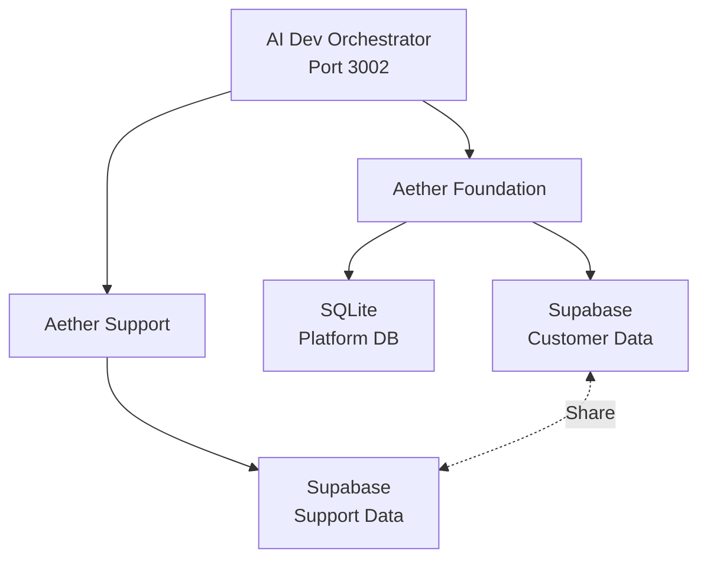

# Cross-Project Integration Guide

## Overview

This guide documents how Aether Foundation (CRM) and Aether Support (Help Desk) integrate and share resources.

---

## Architecture



---

## Project Paths

```
/Users/abedmreyan/Desktop/aether_-foundation/
├── .agent/                    # Shared agent docs
├── .cursor/agents/            # Shared agent personas
├── .tasks/                    # Orchestrator task queue
├── ai_dev_orchestrator/       # The orchestrator itself
├── components/                # Foundation UI
├── services/                  # Foundation logic
├── aether-support/            # Support project
    ├── .agent/                # Support-specific context
    ├── client/                # Support UI
    ├── server/                # Support backend
    └── PROJECT_DOCUMENTATION.md
```

---

## Shared Resources

### 1. AI Dev Orchestrator

**Single instance serves both projects:**
- URL: `http://localhost:3002`
- Database: `ai_dev_orchestrator/data/orchestrator.db`
- Agents: 10 total (shared pool)

**How it works:**
- Foundation: `projectId: 1`
- Support: `projectId: 2` (to be created)

### 2. Agent Workflows

**Location:** `.agent/workflows/`

Both projects use the same workflow library:
- Feature development
- Maintenance
- Integration
- Testing
- Cross-cutting

### 3. Agent Personas

**Location:** `.cursor/agents/`

Shared agents:
- Coordinator
- Architect
- Frontend
- Services
- DevOps
- QA
- Plus 4 project-specific

### 4. Context Documents

**Foundation:**
- `.agent/context.md` (290 lines)
- `.agent/architecture.md`
- `.agent/conventions.md`
- 16+ context files

**Support:**
- `.agent/context.md` (project-specific)
- `.agent/ecosystem.md` (this file)
- `.agent/file-index.md`

---

## Integration Patterns

### Pattern 1: Embedded Widget

**Use Case:** Embed Support chat widget in Foundation CRM

**Workflow:** `integration/third-party-integration.md`

**Steps:**
1. Support team exposes widget as embeddable component
2. Foundation team integrates via `<script>` tag
3. Shared auth context (SSO)
4. Orchestrator coordinates both teams

### Pattern 2: Shared Customer Database

**Use Case:** Support agents need customer data from CRM

**Implementation:**
- Foundation: Writes to Supabase customer DB
- Support: Reads from same Supabase DB
- Shared schema in both projects

### Pattern 3: Cross-Project Task

**Example Task:** "Add chat to CRM customer detail page"

**Orchestrator Plan:**
```yaml
Task: Add live chat to CRM
Steps:
  1. Support Agent: Create widget component
  2. Foundation Agent: Integrate widget
  3. DevOps: Deploy both apps
  4. QA: Test integration
```

---

## Task Routing

### Single Project Tasks

**Foundation only:**
```json
{
  "projectId": 1,
  "title": "Add pipeline field",
  "workflow": "feature-development/new-entity-type"
}
```

**Support only:**
```json
{
  "projectId": 2,
  "title": "Add canned response",
  "workflow": "feature-development/new-ui-component"
}
```

### Cross-Project Tasks

```json
{
  "projectId": [1, 2],  // Both projects
  "title": "Integrate chat into CRM",
  "workflow": "integration/cross-project",
  "steps": [
    {"projectId": 2, "agent": "frontend", "task": "..."},
    {"projectId": 1, "agent": "frontend", "task": "..."}
  ]
}
```

---

## Context Sharing

### When working on Foundation:
Load:
- `.agent/context.md`
- `.agent/architecture.md`
- Foundation-specific files

### When working on Support:
Load:
- `aether-support/.agent/context.md`
- `aether-support/PROJECT_DOCUMENTATION.md`
- Support-specific files

### When working on integration:
Load:
- `.agent/ecosystem.md` (this file)
- Both project contexts
- `workflows/integration/`

---

## Deployment Coordination

### Independent Deployments

**Foundation:**
- Netlify: `aether-foundation.netlify.app`
- Backend: Cloud Run (if needed)

**Support:**
- Netlify: `aether-support.netlify.app`
- Backend: Cloud Run

### Coordinated Deployments

For integration features:
1. Orchestrator creates deployment plan
2. DevOps agent deploys Support first
3. DevOps agent deploys Foundation
4. QA agent validates both

---

## Best Practices

1. **Update both contexts:** Changes affecting integration update both `.agent/` folders
2. **Use orchestrator:** For cross-project tasks, always use orchestrator
3. **Test isolation:** Test each project independently first
4. **Document integration:** Update `ecosystem.md` for new patterns
5. **Shared workflows:** Don't duplicate, reference Foundation's workflows

---

## Future Enhancements

- [ ] Unified deployment dashboard
- [ ] Shared component library
- [ ] Cross-project code sharing (monorepo?)
- [ ] Automatic context syncing
- [ ] Integration test suite

---

**Created:** 2025-12-18
**Last Updated:** 2025-12-18
