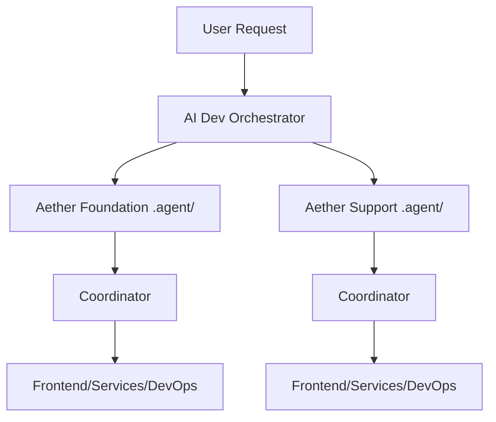

# Aether Support - Agent Orchestration

This document defines how AI agents work together on the Aether Support project.

---

## Overview

Aether Support uses the same **multi-agent orchestration system** as Aether Foundation, sharing the AI Dev Orchestrator.



---

## Project Context

**What is Aether Support?**
A multi-tenant help desk platform with:
- Live chat widget (web/mobile)
- Agent dashboard
- AI chatbots with RAG
- VoIP integration (Twilio)
- Workflow automation

**Tech Stack:**
- React + TypeScript + Vite
- tRPC + Drizzle ORM
- PostgreSQL (Supabase)
- Socket.io (real-time)
- Twilio (VoIP)

---

## Agent Personas

This project uses the same agents as Foundation:

| Agent | Use For |
|-------|---------|
| **Coordinator** | Complex multi-step tasks |
| **Architect** | System design, database schema |
| **Frontend** | React components, UI |
| **Services** | tRPC endpoints, business logic |
| **DevOps** | Deployment, infrastructure |
| **QA** | Testing, debugging |

**Refer to:** `/Users/abedmreyan/Desktop/aether_-foundation/.cursor/agents/`

---

## Context Files

| File | Purpose |
|------|---------|
| `context.md` | Project overview (this file) |
| `ecosystem.md` | Cross-project integration |
| `file-index.md` | Task-to-file lookup |
| `workflows/` | Step-by-step guides (shared with Foundation) |

---

## Workflows

Aether Support uses the **same workflow library** as Foundation:

```
/Users/abedmreyan/Desktop/aether_-foundation/.agent/workflows/
```

Key workflows:
- Feature development
- API endpoint creation
- UI component building
- Database schema changes
- Deployment
- Testing

**Bridge workflow:** `integration/process-orchestrator-task.md`

---

## Integration with Aether Foundation

### Shared Infrastructure
- Same AI Dev Orchestrator instance
- Same agent pool
- Same workflow library

### Cross-Project Tasks
Use workflows in:
```
.agent/workflows/integration/
```

Example: Integrating Support chat widget into Foundation CRM.

---

## Getting Started

### For New Tasks

1. **Check orchestrator** → http://localhost:3002
2. **Load context:** `@.agent/context.md` + task-specific docs
3. **Follow workflow:** From shared `.agent/workflows/`
4. **Update status:** In orchestrator and `current-work.md`

### Quick Reference

| Task | Workflow | Primary Files |
|------|----------|---------------|
| Add chat feature | `feature-development/full-feature.md` | `server/routers/`, `client/src/pages/` |
| Twilio integration | `integration/third-party-integration.md` | `server/services/twilio.ts` |
| Deploy changes | `integration/deployment.md` | Config files, build |

---

## Documentation

**Project docs:** `PROJECT_DOCUMENTATION.md` (40k+ words)
**Todo tracking:** `todo.md`
**Current work:** Update Foundation's `.agent/current-work.md`

---

**Last Updated:** 2025-12-18
**Orchestrator Port:** 3002
